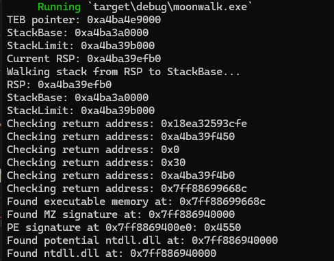

# moonwalk: DLL Base Address Finder

This Rust library and CLI tool demonstrates an alternative method to find the base address of loaded DLLs without using a Process Environment Block (PEB) walk. This technique is particularly useful in scenarios where PEB walking might be detected or blocked.

## How It Works

The program uses a stack walking approach to locate DLLs by:

1. **Accessing the Thread Environment Block (TEB)**:
   - Uses inline assembly to read the TEB pointer from the GS segment register (GS:[0x30])
   - Retrieves the stack base (GS:[0x08]) and stack limit (GS:[0x10]) from the TEB

2. **Stack Walking**:
   - Starts from the current stack pointer (RSP)
   - Walks up the stack looking for return addresses
   - Checks each address for executable memory
   - Uses VirtualQuery to validate memory regions

3. **Module Identification**:
   - For each potential return address, checks if it points to executable memory
   - When executable memory is found, walks backwards to find the PE header
   - Validates the module by checking:
     - MZ signature (DOS header)
     - PE signature
     - DLL characteristics
     - 64-bit architecture
     - Module name from export directory

4. **Validation**:
   - Verifies the module is the target DLL by checking its name in the export directory
   - Confirms all PE header structures are valid

## Why This Approach?

Traditional methods of finding DLLs often involve walking the PEB's module list. While effective, this approach can be:
- Detected by security software
- Blocked in certain environments

This stack walking method provides an alternative that:
- Doesn't rely on the PEB
- Can work in environments where PEB walking is blocked

## Requirements

- Rust (nightly toolchain)
- Windows x64
- `winapi` crate

## Usage

### As a Library

Add to your `Cargo.toml`:
```toml
[dependencies]
moonwalk = { git = "https://github.com/Teach2Breach/moonwalk.git" }
```

Example usage in your code:
```rust
use moonwalk::find_dll_base;

fn main() {
    // Find ntdll.dll
    if let Some(ntdll_base) = find_dll_base("ntdll.dll") {
        println!("ntdll.dll base: 0x{:X}", ntdll_base);
    }

    // Case-insensitive, .dll extension optional
    if let Some(kernel32_base) = find_dll_base("KeRNEl32") {
        println!("kernel32.dll base: 0x{:X}", kernel32_base);
    }
}
```

### As a CLI Tool

Build:
```bash
cargo build --release
```

Run:
```bash
# Find ntdll.dll (default)
cargo run --release

# Find specific DLL (case insensitive, .dll extension optional)
cargo run --release kernel32.dll
cargo run --release KeRNEl32
cargo run --release USER32
```

## Example



## Notes

- All memory access is validated using `VirtualQuery` for safety, if you don't want to make any API calls before getting the DLL base address there are other ways. VirtualQuery is used for simplicity in this PoC
- DLL names are case-insensitive and the .dll extension is optional
- Works best with DLLs that are commonly used in the call stack
- This Proof of Concept library contains print statements which are helpful for understanding what is happening and debugging. In some scenarios, print statements like this are undesirable and should be removed. The OPSEC branch removes all print statements and just returns the address.