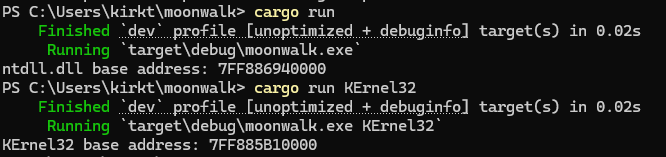

# moonwalk: DLL Base Address Finder & Function Discovery

This is the opsec branch which has no dependencies and removes all API calls and print statements for better operational security. 

This Rust library and CLI tool demonstrates alternative methods to find the base address of loaded DLLs and locate specific functions without using a Process Environment Block (PEB) walk, export address table (EAT) parsing, or Windows API calls. These techniques are particularly useful in scenarios where API calls might be detected or blocked, or when export tables have been modified by security software.

## How It Works

### DLL Base Address Discovery

The program uses a stack walking approach to locate DLLs by:

1. **Accessing the Thread Environment Block (TEB)**:
   - Uses inline assembly to read the TEB pointer from the GS segment register (GS:[0x30])
   - Retrieves the stack base (GS:[0x08]) and stack limit (GS:[0x10]) from the TEB
   - No API calls required

2. **Stack Walking**:
   - Starts from the current stack pointer (RSP)
   - Walks up the stack looking for return addresses
   - Uses direct memory reads with exception handling instead of VirtualQuery
   - Validates memory access through try/catch blocks

3. **Module Identification**:
   - For each potential return address, checks if it points to executable memory
   - When executable memory is found, walks backwards to find the PE header
   - Validates the module by checking:
     - MZ signature (DOS header)
     - PE signature
     - DLL characteristics
     - 64-bit architecture
     - Module name from export directory
   - All validation done through direct memory reads with exception handling

4. **Memory Access**:
   - Uses direct memory reads instead of VirtualQuery
   - Handles access violations through exception handling
   - No Windows API calls until after DLL base is found
   - More stealthy than API-based approaches

### Function Discovery via Signature Scanning

Once a DLL base address is found, moonwalk can locate specific functions using byte pattern matching:

1. **Pre-built Signatures**:
   - Function signatures are extracted from clean DLLs downloaded from Microsoft symbol servers
   - Signatures include function name, RVA, and byte patterns
   - No runtime network access required

2. **Hook-Resistant Approach**:
   - Signatures start matching from byte 12, skipping potential EDR hook bytes
   - Functions are found by matching deeper in their code
   - Works even when EDR hooks the function entry point

3. **No Export Table Dependency**:
   - Bypasses export address table (EAT) parsing entirely
   - Reliable even when export tables are modified or corrupted
   - Version-specific accuracy through pre-built signatures

4. **Signature Management**:
   - Python script (`scripts/update_signatures.py`) updates signatures from SQLite database
   - Target function filtering via `scripts/target_functions.txt`
   - Two-step replacement ensures clean signature updates

## Why This Approach?

### DLL Discovery
Traditional methods of finding DLLs often involve walking the PEB's module list. While effective, this approach can be:
- Detected by security software
- Blocked in certain environments

This stack walking method provides an alternative that:
- Doesn't rely on the PEB
- Can work in environments where PEB walking is blocked
- Makes no API calls until after finding the DLL
- Uses direct memory access with exception handling
- Can work in environments where API calls are monitored
- Leaves fewer traces in userland

### Function Discovery
Traditional function discovery relies on parsing export address tables (EAT), which can be:
- Modified or corrupted by security software
- Hooked by EDR solutions
- Unreliable in certain environments

The signature scanning approach provides an alternative that:
- Bypasses EAT parsing entirely
- Works even when export tables are modified
- Resistant to EDR hooking through deep pattern matching
- Version-specific accuracy through pre-built signatures
- No runtime network access required

## Requirements

- Rust (nightly toolchain)
- Windows x64
- Python 3.x (for signature management scripts)

## Important: Release Build Configuration

**When using this library in release builds, specific compiler settings are required to maintain stack walking reliability.**

The stack walking technique relies on predictable stack frame layouts and return address patterns. Aggressive compiler optimizations in release mode can interfere with this approach by:
- Removing or reordering stack frames
- Inlining functions that would otherwise create return addresses
- Optimizing away stack-based return address patterns

### Required Release Build Settings

Add these settings to your `Cargo.toml` when using moonwalk as a library:

```toml
[profile.release]
opt-level = 0  # Disable optimizations for stack walking reliability
lto = false    # Disable link-time optimization
codegen-units = 1  # Single codegen unit for consistency
```

### Technical Rationale

- **`opt-level = 0`**: Prevents aggressive optimizations that can remove stack frames
- **`lto = false`**: Disables link-time optimization that can inline across modules
- **`codegen-units = 1`**: Reduces optimization variations

Without these settings, release builds may fail to find DLLs even when debug builds work correctly. Other build settings may work, more testing is needed. This only applies to the version on the opsec branch.

## Usage

### As a Library

Add to your `Cargo.toml`:
```toml
[dependencies]
moonwalk = { git = "https://github.com/Teach2Breach/moonwalk.git", branch = "opsec" }

# Required for release builds
[profile.release]
opt-level = 0
lto = false
codegen-units = 1
```

Example usage in your code:
```rust
use moonwalk::find_dll_base;

fn main() {
    // Find ntdll.dll
    if let Some(ntdll_base) = find_dll_base("ntdll.dll") {
        println!("ntdll.dll base: 0x{:X}", ntdll_base);
    }

    // Case-insensitive, .dll extension optional
    if let Some(kernel32_base) = find_dll_base("KeRNEl32") {
        println!("kernel32.dll base: 0x{:X}", kernel32_base);
    }
}
```

### As a CLI Tool

Build:
```bash
cargo build --release
```

Run:
```bash
# Find DLL base address (case insensitive, .dll extension optional)
cargo run --release ntdll.dll
cargo run --release KeRNEl32
cargo run --release USER32

# Find specific functions in a DLL
cargo run --release ntdll.dll NtCreateFile NtQuerySystemTime
cargo run --release kernel32.dll Sleep GetTickCount
```

## Signature Management

### Updating Function Signatures

The `scripts/update_signatures.py` script allows you to update function signatures from a SQLite database:

```bash
# Update signatures for ntdll.dll
python3 scripts/update_signatures.py ntdll

# Update signatures for specific Windows version
python3 scripts/update_signatures.py ntdll 10.0.26100
```

**Note**: The SQLite database (`ntdll_signatures_v2.db`) is generated by a separate signature builder tool (dll_inspector) that will be released at a later date. This tool downloads clean DLLs from Microsoft symbol servers and extracts function signatures.

### Target Function Filtering

Create a `scripts/target_functions.txt` file to specify which functions to include:

```
NtCreateFile
NtQuerySystemTime
NtOpenFile
NtReadFile
NtWriteFile
```

Only functions listed in this file will be added to the hardcoded signature "database" in signature_scanner.rs.

## Example



## Notes

- No Windows API calls are made until after finding the DLL base
- Memory access is validated through exception handling
- DLL names are case-insensitive and the .dll extension is optional
- Works best with DLLs that are commonly used in the call stack
- This branch removes all print statements and API calls (virtualquery) for better operational security
- **Release builds require specific compiler settings to maintain stack walking reliability**
- Function discovery bypasses export address table parsing entirely
- Hook-resistant signature matching starts from byte 12 to avoid EDR hooks
- Signatures are pre-built from clean DLLs, no runtime network access required